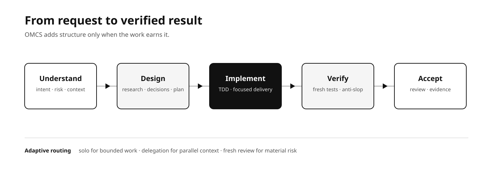
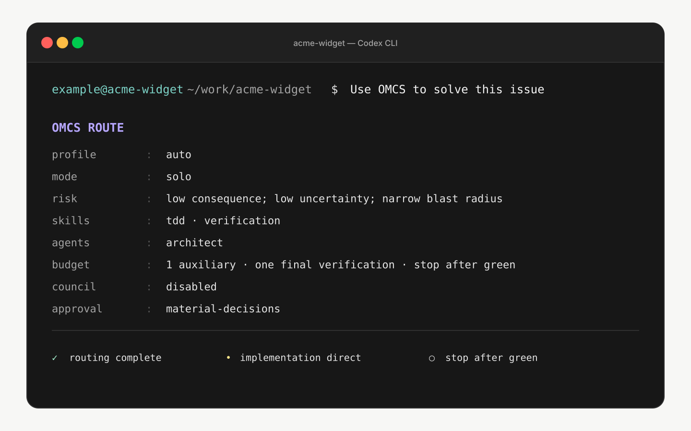
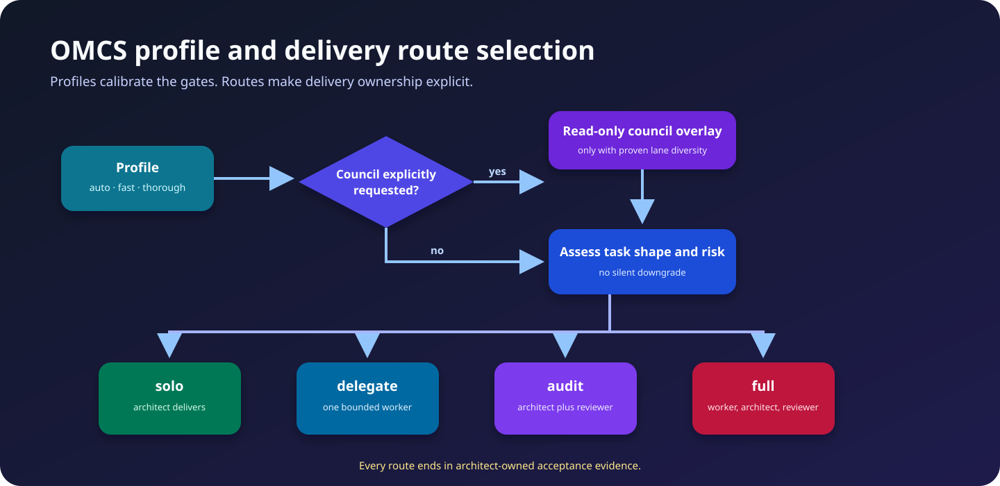
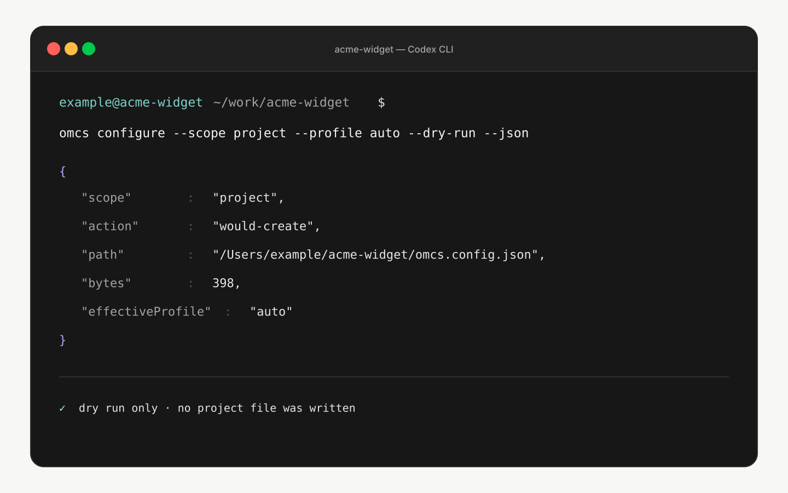
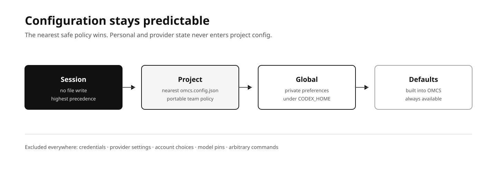
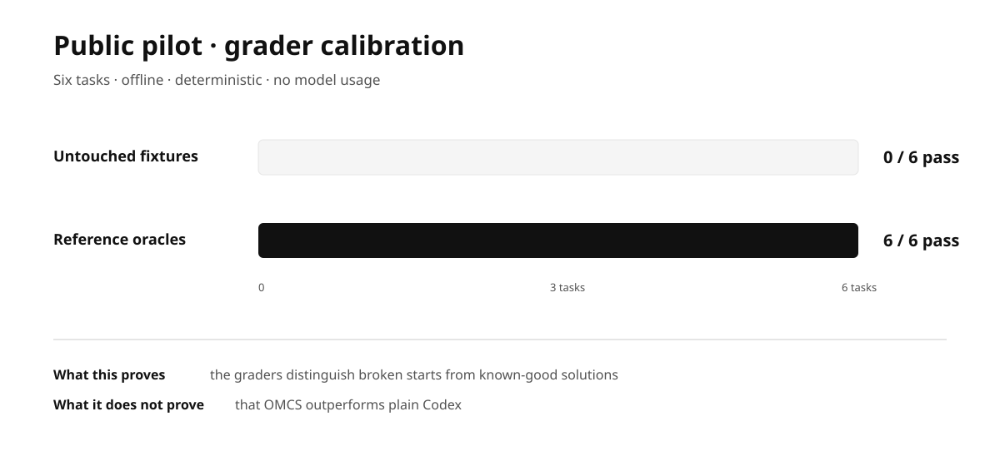
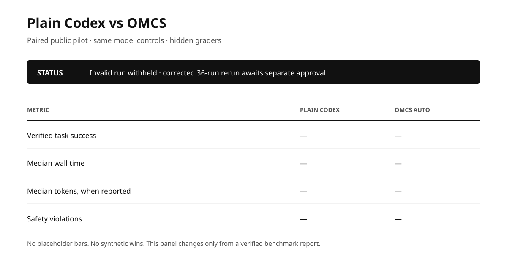
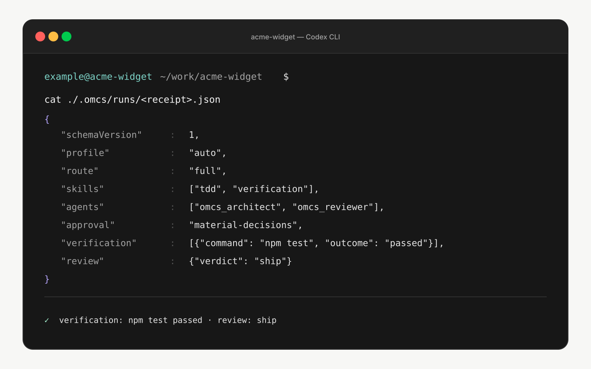

# Oh My Codex Slim

**A small, Codex-native orchestration system for delivering better engineering work.**

Say **“use OMCS to solve this issue”** in Codex Desktop or the CLI. OMCS chooses a proportionate route, names the agents and skills it will use, and keeps the architect accountable for fresh evidence and acceptance.

```text
Use OMCS to solve this issue: make billing retries idempotent and add regression coverage.
```



OMCS is intentionally slim: eight native Codex roles, sixteen focused skills, ownership-safe configuration, a bounded local code-intelligence MCP, and no hidden background engine. It works with native Codex alone. [OpenCodex](https://github.com/lidge-jun/opencodex) is optional and is the only supported external-model transport; it owns provider accounts, routing, service state, and credentials.

## What an OMCS run looks like

Before work, OMCS makes the decision visible. The declaration is not a promise of a particular model result; it is the workflow contract the architect must follow.



```text
OMCS ROUTE
profile: auto
mode: full
risk: new subsystem with public interfaces and persistent configuration
skills: context, codebase-design, plan, tdd, verification, code-review
agents: architect → explorer + librarian → terra-fixer → reviewer
approval: material-decisions
```

The route can escalate when evidence increases risk. It never silently downgrades. See [execution modes](docs/execution-modes.md) and the route map below.



## First use: project, global, or session

When no policy exists, OMCS offers three choices—just like a good advisor should:

1. **Configure this project (recommended):** checked-in, portable team policy.
2. **Configure globally:** private preferences below `${CODEX_HOME}/oh-my-codex-slim/`.
3. **Use for this session:** safe defaults with no file write.



```bash
omcs configure --scope project --profile auto --dry-run --json
omcs configure --scope project --profile auto --json
omcs config show --effective --json
```



Project policy never includes credentials, provider settings, personal account choices, or arbitrary command paths. Read [configuration](docs/configuration.md) for the schema, precedence, and safe update behavior.

## Profiles and routes

| Profile | Meaning |
| --- | --- |
| `auto` | Default: adapt clarification, design, delegation, cleanup, and review to the observed risk. |
| `fast` | Prefer direct work or one efficient implementer while retaining required safety checks. |
| `thorough` | Raise design, TDD, anti-slop, documentation, verification, and fresh-review gates. |
| `council` | Explicit-only, read-only consultation before a normal delivery route; fails closed without proven diversity. |

| Route | Delivery owner |
| --- | --- |
| `solo` | Architect plans, implements, verifies, and self-reviews. |
| `delegate` | One implementer delivers a bounded packet; architect verifies. |
| `audit` | Architect implements; a fresh reviewer audits. |
| `full` | One implementer delivers; architect verifies; a fresh reviewer audits. |

The council is an advisory overlay, not a fifth route. [Execution modes](docs/execution-modes.md) explains when each discipline earns its cost.

## The team and skill pipeline

The architect owns intent, route selection, decomposition, parent verification, and acceptance. Explorer, Librarian, and Oracle compress read-only context. Fixers and Designer deliver bounded work. The Reviewer is fresh and read-only; any post-review edit requires fresh verification and a new review when the route requires one.

The sixteen skills compose the lifecycle: `omcs`, `context`, `codebase-design`, `research`, `plan`, `tdd`, `implement`, `ai-slop-cleaner`, `simplify`, `verification`, `code-review`, `codemap`, `diagnose`, `deepwork`, `deep-interview`, and the `omcs-orchestrate` compatibility alias. Details: [agents and skills](docs/agents-and-skills.md).

```text
intent → config / route → context / grill → explore / research → design / material decision
  → plan → TDD implementation → anti-slop / simplify → verification → risk-gated review → acceptance
```

## Install and operate safely

Requires Node.js 22.19 or newer and Codex CLI. OpenCodex is optional—install it separately only when you want external-model routing.

```bash
git clone https://github.com/Rafcin/oh-my-codex-slim.git
cd oh-my-codex-slim
npm ci
npm run build
npm pack
npm install -g ./oh-my-codex-slim-0.1.0.tgz
codex plugin marketplace add Rafcin/oh-my-codex-slim --ref main --json
codex plugin add oh-my-codex-slim@omcs-local --json
omcs setup --dry-run --json
omcs setup --json
omcs doctor --json
```

OMCS does not install an OpenCode runtime, Codex Router, LazyCodex, tmux, telemetry, a daemon, or a second credential store. `npm run verify:release` is an offline gate. A real-model prompt is quota-consuming and requires separate explicit approval.

Continue with [installation](docs/installation.md), [architecture](docs/architecture.md), [OpenCodex integration](docs/opencodex.md), [troubleshooting](docs/troubleshooting.md), and [examples](docs/examples.md).

## Safe lifecycle

```bash
omcs update --dry-run --json
omcs agents check --json
omcs uninstall --dry-run --json
```

Update is explicit-only and reuses setup ownership. Uninstall removes only the comment-only OMCS lifecycle block and digest-matching `agents/omcs-*.toml` files. It preserves Codex-owned marketplace registration, unrelated Codex configuration, user agents, OpenCodex data, and any pre-existing migration rollback evidence.

The repository retains attributed legacy Codex Router compatibility code only so a user with an earlier OMCS migration manifest can recover or inspect rollback state. Codex Router is not the supported active transport, and OMCS no longer exposes Router installation, update, panel, or OpenCodex-to-Router cutover as normal lifecycle operations.

## Benchmark OMCS against plain Codex

OMCS ships a paired, hidden-grader benchmark harness and a six-task calibration pilot. It freezes and hashes the model controls, prompts, fixtures, graders, Codex version, and OMCS plugin surface; runs plain Codex without user rules, plugins, or hooks; runs OMCS with the exact plugin, MCP, and eight-agent catalog; and grades both in a pinned, networkless, read-only container.

### What is verified today



This is calibration evidence, not a performance claim. The six broken starting fixtures fail their hidden graders, the six checked-in reference oracles pass, and the offline grader gate reports no safety violations. That proves the pilot can discriminate broken from known-good work; it does not say which model arm performs better.

### Comparative performance



No valid public comparison has completed, so OMCS does not publish invented success, speed, or token numbers. An initial 36-run matrix was executed on August 27, 2026, then invalidated during transcript audit because the treatment sandbox could not read the installed OMCS skill files. Those numbers are not performance evidence. The harness now proves the exact treatment skill root is readable while authentication remains denied; a corrected quota-consuming rerun still requires separate explicit approval. When a verified run exists, this panel will report success, paired improvements and regressions, median wall time, token coverage, and safety violations separately—never as one vanity score.

### What the benchmark is designed to reveal

| Work shape | Hypothesis before measurement | What would falsify it |
| --- | --- | --- |
| Multi-file fixes, security work, and material interfaces | OMCS should benefit from explicit planning, bounded implementation, and fresh review. | No verified-success gain, or more paired regressions than improvements. |
| Diagnosis and documentation with several evidence sources | Explorer and reviewer roles should reduce omissions and unsupported claims. | Similar defect escape with materially higher time or token use. |
| Tiny, obvious edits | OMCS may struggle to justify orchestration overhead; `fast` or `solo` should be more proportionate. | `auto` adds latency or tokens without improving verified success. |
| Ambiguous or poorly specified tasks | Fail-closed clarification should improve safety but may reduce completion speed. | More abandoned work without fewer unsafe or incorrect outcomes. |

These are testable hypotheses, not claims that OMCS already shines in those categories.

### Code quality target

The public pilot includes reviewable reference solutions so the graders themselves can be audited. For example, the query-parser task requires repeated-key ordering, `+` decoding, missing values, and prototype-pollution defenses:

```js
const blockedKeys = new Set(["__proto__", "constructor", "prototype"]);

const previous = result[key];
if (previous === undefined) result[key] = value;
else if (Array.isArray(previous)) previous.push(value);
else result[key] = [previous, value];
```

That excerpt is from the checked-in reference oracle, not an output from the paired benchmark. Actual plain-Codex and OMCS-generated examples will be published only from the verified paired run, including failures and regressions rather than cherry-picked successes.

```bash
omcs benchmark plan bench/prompt-refinement-pilot.json --json
omcs benchmark run bench/prompt-refinement-pilot.json --dry-run --json
```

The default pilot is 36 model runs and is never launched by planning, testing, or release verification. Actual execution requires both explicit user approval for that matrix and the CLI's `--execute --approve-model-usage` gate. See [benchmarking OMCS](docs/benchmarking.md) for task-quality proof, isolation, interpretation, prompt-refinement workflow, and private held-out suites.

## Privacy and verification

Local runtime state under `.omcs/`, `.gjc/`, and `.superpowers/sdd/` is ignored and must never be committed. `npm run verify:release` is an offline acceptance gate. A real model smoke is optional, billed, and requires separate explicit approval.

The public MCP surface exposes six code-intelligence tools. Its host binds operations to the launch-time project root, rejects oversized files and trees, and does not expose the legacy dependency-clone helper.



Receipts are optional, local, ignored evidence summaries—not an execution engine. They record only policy and command outcomes, never prompts, source code, raw command output, environment variables, credentials, provider metadata, absolute user paths, or model responses.

## Authors, owners, and licenses

OMCS is original integration work built on a pinned attributed MIT baseline and attributed behavior/interface research. Full revision, license, source-path, adaptation-status, author, contributor, and repository-owner metadata is in [THIRD_PARTY_NOTICES.md](THIRD_PARTY_NOTICES.md).

The notices name the published identities we rely on: Yeachan Heo (`Yeachan-Heo`), Alvin (`alvinunreal`), Matt Pocock (`mattpocock`), Daniel McAteer (`DannyMac180`), YeonGyu-Kim (published package author for the behavioral-only Oh My OpenAgent reference; no copyright/licensor is invented), `opencodex contributors` and owner `lidge-jun`, and Herrington Darkholme (`HerringtonDarkholme`) for ast-grep. No fuller personal names are invented where upstream does not publish one. [Upstream sources](docs/upstream-sources.md) and [THIRD_PARTY_NOTICES.md](THIRD_PARTY_NOTICES.md) are the authoritative ledgers.

Licensed under MIT; see [LICENSE](LICENSE).
