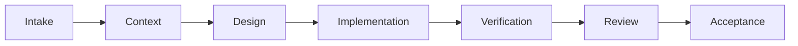

# Sample Orchestration Tool

This tool adds a small, risk-aware orchestration layer to an existing coding agent. Choose a public profile and let the tool select the internal route.

## Profiles and routes

- `fast` keeps bounded work direct and verifies the result.
- `auto` scales the workflow from the evidence and risk it observes.
- `thorough` uses the complete implementation and review path for wider changes.

Profiles are the user-facing choice. Internally, `solo` keeps tightly coupled work with the architect, `delegate` assigns a bounded implementation, `audit` adds an independent reviewer to architect-owned work, and `full` combines delegated implementation with independent review.

## Lifecycle

## Evidence and privacy

Source verification checks code and static contracts. Isolated local verification exercises packaged behavior in a disposable fixture. Runtime verification exercises the real integration and is reported separately.

Receipts contain concise route and verification outcomes. Credentials are never stored in a receipt, and raw prompts or agent output do not belong there.
